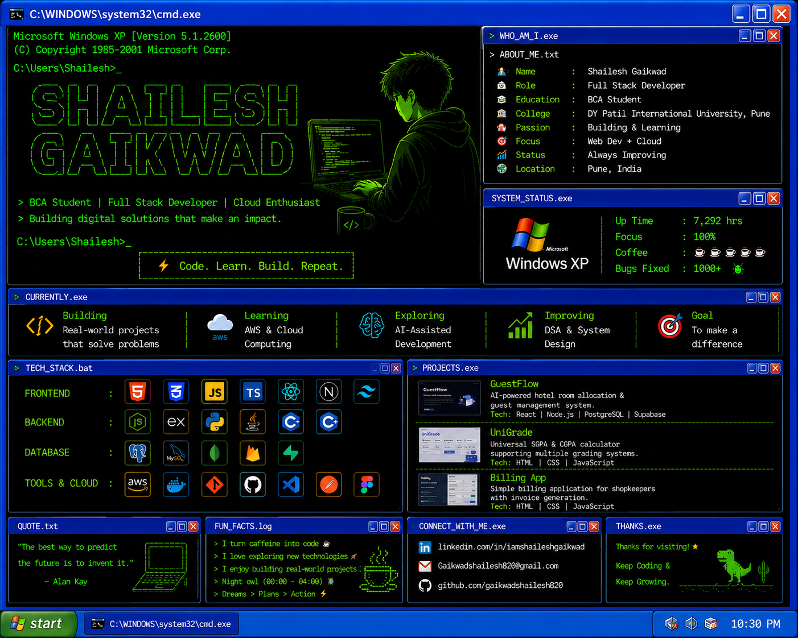

<div align="center">

# 



</div>

---

## 💻 About Me

```cmd
Microsoft Windows XP [Version 5.1.2600]

C:\Users\Shailesh> whoami

Name        : Shailesh Gaikwad
Role        : Full Stack Developer
Education   : BCA Student
College     : DY Patil International University
Location    : Pune, India

Current Focus
-------------
> Full Stack Development
> Cloud Computing
> AI-Assisted Web Development

Current Project
---------------
> GuestFlow
```

---

# ⚡ Tech Stack

### Frontend

<p>


</p>

### Backend

<p>


</p>

### Database

<p>


</p>

### Cloud & Tools

<p>


</p>

---

# 🚀 Featured Projects

<table>

<tr>

<td width="50%">

## 🏨 GuestFlow

AI-powered Hotel Room Allocation & Guest Management System.

**Tech**

React • Node.js • PostgreSQL • Supabase

</td>

<td align="center">

<a href="https://github.com/gaikwadshailesh820/guestflow">

</a>

</td>

</tr>

<tr>

<td width="50%">

## 🎓 UniGrade

Universal SGPA & CGPA Calculator supporting multiple grading systems.

**Tech**

HTML • CSS • JavaScript

</td>

<td align="center">

<a href="https://github.com/gaikwadshailesh820/UniGrade">

</a>

</td>

</tr>

</table>

---

# 🌐 Connect With Me

<p align="center">

<a href="https://www.linkedin.com/in/iamshaileshgaikwad/">


</a>

<a href="mailto:Gaikwadshailesh820@gmail.com">


</a>

<a href="https://github.com/gaikwadshailesh820">


</a>

</p>

<p align="center">

<a href="https://www.linkedin.com/in/iamshaileshgaikwad/">LinkedIn</a> •
<a href="mailto:Gaikwadshailesh820@gmail.com">Email</a> •
<a href="https://github.com/gaikwadshailesh820">GitHub</a>

</p>

---

<p align="center">


</p>

---

<p align="center">


</p>

---

<div align="center">

### ⚡ Code. Learn. Build. Repeat.

</div>
